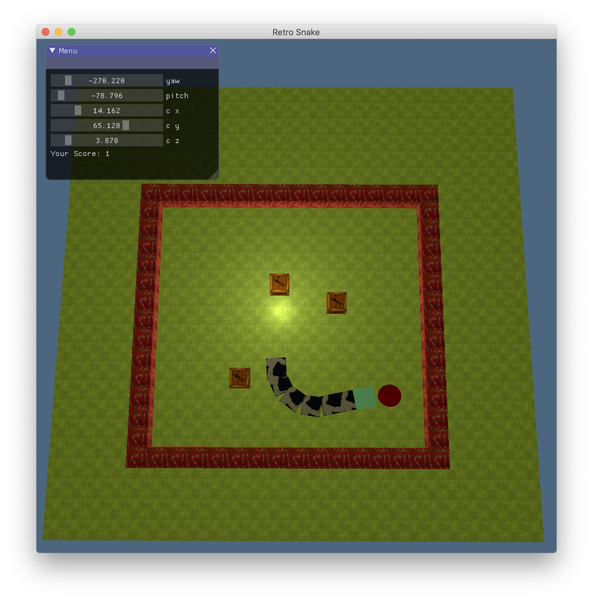
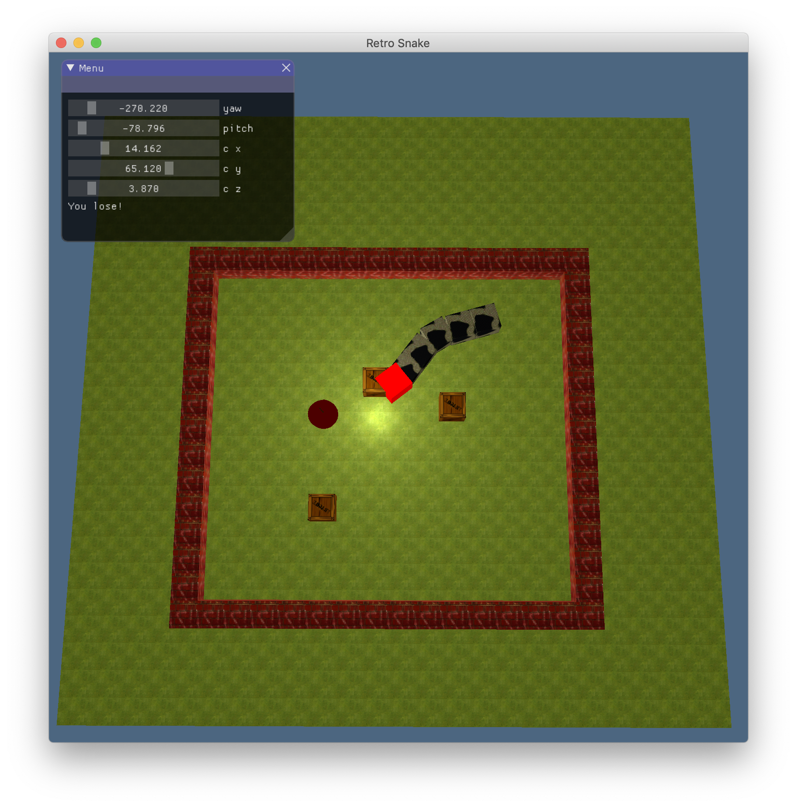

# Retro-Snaker
simple implementation of retro-snaker using OpenGL

## dependencies
1. openGL
2. glad
3. glfw
4. assimp
5. imgui

## run on macOS
```
make & make run
```

## feature
1. control the direction of the snake using WASD
2. game over if collide with obstacles
3. game over if collide with the snake itself
4. get score and lengthen the snake if collide with the apple
5. cross over the boundary and appear from the other side if collide with the boundary
5. the length of the snake will not be larger than 12
6. adjust the position and the direction of the camera using ImGUI

## snapshot






